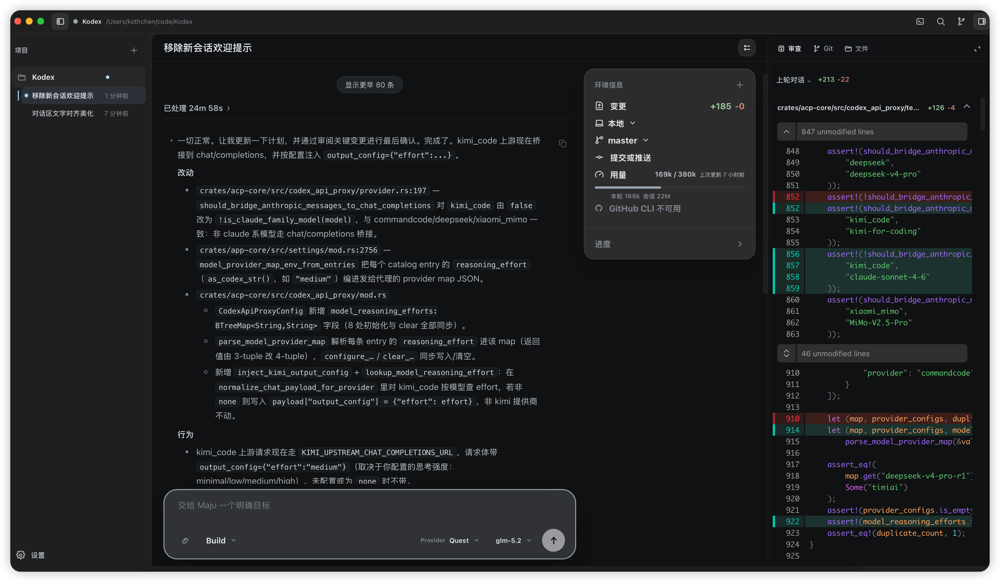
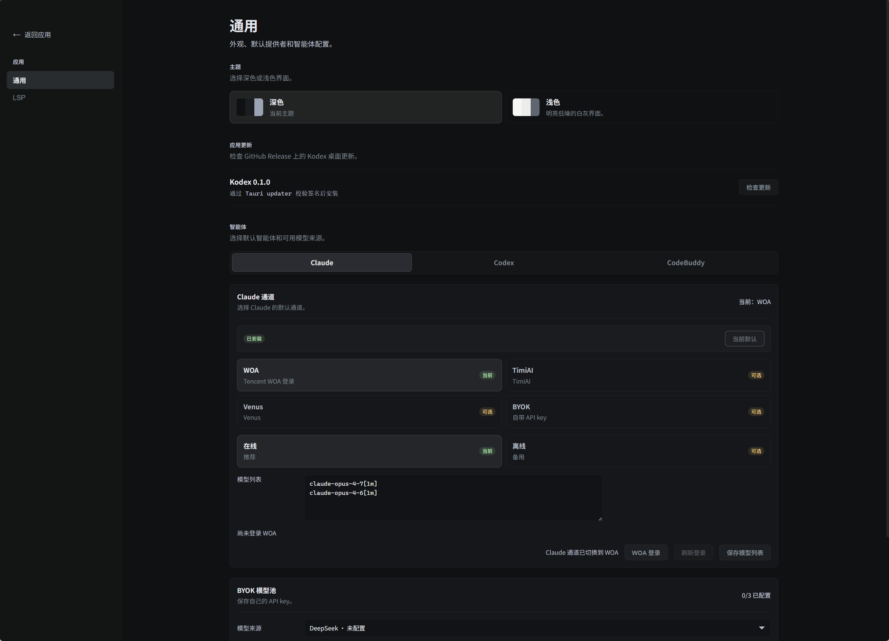

# Kodex

Kodex 是一个 ACP-powered coding editor：用 Rust/Tauri 承载本地能力，用 React + Monaco 提供编辑体验，把智能体对话、代码编辑、Git 审阅和终端放在同一个工作台里。

它适合需要“边聊边改、边看 diff 边落地”的工程场景：智能体负责生成和执行方案，Kodex 负责把上下文、文件、变更和权限边界稳稳托住。

## 截图

| 工作台总览                                                                          |
| ----------------------------------------------------------------------------------- |
|  |

| 首次设置                                                                                   |
| ------------------------------------------------------------------------------------------ |
|  |

## 亮点

- **一个窗口完成编码闭环**：对话、Monaco 编辑器、diff review、Git changes、集成终端同屏协作。
- **ACP 原生**：后端通过 ACP 接入 CodeBuddy、Codex ACP、Claude Agent ACP 等智能体。
- **变更可审阅**：智能体写文件、终端命令和手动编辑都会进入变更视图，方便逐文件检查和回滚。
- **工作区级上下文**：文件树、会话列表、历史消息、工具调用和仓库状态围绕当前 workspace 组织。
- **本地优先**：Rust 后端负责会话、权限、Git、SQLite 持久化和文件系统访问，前端只消费共享 DTO。

## 初次使用

1. 启动 Kodex 后，先进入设置页选择默认智能体。
2. 如果有自己的模型 Key，选择 **BYOK** 模式，从 **CommandCode**、**DeepSeek**、**Kimi Code**、**Xiaomi Token Plan** 等模型来源中选择一个，填入对应的 API Key。
3. 如果本机已经安装 CodeBuddy CLI，也可以选择 CodeBuddy 作为 ACP 后端。
4. 打开一个代码目录作为 workspace，在底部输入需求；智能体执行后的文件改动会出现在右侧 Review/Git 区域。

## 常见工作流

- **让智能体改代码**：在 composer 里描述目标，必要时引用 workspace 文件，等待工具调用完成后审阅 diff。
- **人工接管编辑**：从文件树或变更列表打开文件，直接在 Monaco 中修改并保存。
- **审阅和提交**：在右侧 Review 面板查看当前会话、当前轮次或 Git worktree 的变更，再选择 stage/unstage。
- **运行命令**：打开底部终端执行测试、启动服务或切换环境；终端会按 workspace 复用。
- **切换会话**：左侧会话列表保留历史上下文，支持在同一 workspace 下恢复不同任务。

## 架构概览

Kodex 保持 protocol、state、services、presentation 的边界清晰：

```text
workspace-model  ← pure shared DTOs
  ↑
git-service / session-store / acp-core
  ↑
app-core         ← orchestration and reducer state
  ↑
kodex-desktop    ← Tauri command bridge + React UI
```

## 项目结构

```text
apps/desktop/
  src-tauri/       Tauri v2 desktop shell, command bridge, native state wrapper
  ui/              React + TypeScript frontend (Vite, Monaco Editor)
crates/
  acp-core/        ACP transport, session lifecycle, event mapping, permissions
  app-core/        Application orchestration, reducer-based state, session flow
  git-service/     Git repository inspection and staging via git2
  session-store/   SQLite session persistence under the Kodex data directory
  terminal-service/ Integrated PTY terminal service
  workspace-model/ Shared DTOs consumed by backend and frontend bindings
tools/
  mock-acp-agent/  Mock ACP subprocess for integration testing
docs/              Architecture notes, screenshots, and technical docs
openspec/          Feature specifications and change proposals
```

## 前置要求

- [Rust](https://rustup.rs/) stable toolchain
- [Node.js](https://nodejs.org/) v18+ with npm
- Tauri v2 CLI, either through the workspace npm scripts or globally via:

  ```bash
  cargo install tauri-cli --version "^2"
  ```

- 可选：CodeBuddy CLI、Codex ACP 或 Claude Agent ACP 作为 ACP 后端

## 开发

Install frontend dependencies first:

```bash
npm --prefix apps/desktop/ui install
```

Start the desktop app in development mode:

```bash
cargo tauri dev --manifest-path apps/desktop/src-tauri/Cargo.toml
```

This starts the Vite dev server on `http://localhost:1420` and launches the Tauri window with hot reload.

You can also run from the Tauri crate directory:

```bash
cd apps/desktop/src-tauri
cargo tauri dev
```

## 构建与打包

```bash
npm --prefix apps/desktop/ui run desktop:build
```

This command runs the Tauri production pipeline:

1. Runs `npm run build` in `apps/desktop/ui` (TypeScript compilation + Vite bundling)
2. Compiles the Rust workspace crates in release mode
3. Embeds the frontend assets from `apps/desktop/ui/dist`
4. Generates platform-specific installers under `target/release/bundle/`
5. Leaves the directly launchable binary under `target/release/`

Do **not** use `cargo build -p kodex-desktop --release` to produce a clickable desktop app. A plain Cargo build does not run the Tauri production pipeline and can leave the app trying to load the development `devUrl` instead of embedded assets.

If a release executable opens with a `localhost` connection error, rebuild with the Tauri packaging command above. A later plain Cargo build can overwrite the packaged executable with a non-packaged binary.

Common outputs:

- Windows executable: `target/release/kodex-desktop.exe`
- Windows NSIS installer: `target/release/bundle/nsis/Kodex_0.1.0_x64-setup.exe`
- macOS app/bundle output: `target/release/bundle/macos/` and `target/release/bundle/dmg/`
- Linux package output: `target/release/bundle/deb/` and/or `target/release/bundle/rpm/`

| Platform | Output Formats          |
| -------- | ----------------------- |
| Windows  | `.msi`, `.nsis`, `.exe` |
| macOS    | `.dmg`, `.app`          |
| Linux    | `.deb`, `.rpm`          |

Bundle configuration lives in `apps/desktop/src-tauri/tauri.conf.json`:

- **productName**: `Kodex`
- **identifier**: `com.kodex.editor`
- **bundle.targets**: `"all"` (generates all supported formats for the current platform)
- **icons**: `apps/desktop/src-tauri/icons/` (`.ico`, `.icns`, `.png` variants)

## 自动更新与发布

Kodex uses the Tauri v2 updater and GitHub Releases. The desktop app checks:

```text
https://github.com/koth/Kodex/releases/latest/download/latest.json
```

Before publishing an updater-enabled release, replace `KODEX_UPDATER_PUBLIC_KEY_PLACEHOLDER` in `apps/desktop/src-tauri/tauri.conf.json` with a real Tauri updater public key:

```bash
cd apps/desktop/ui
npx tauri signer generate -w ~/.tauri/kodex.key
```

The command prints the public key and writes the private key to `~/.tauri/kodex.key`.

Configure these GitHub repository secrets:

- `TAURI_SIGNING_PRIVATE_KEY`: contents of `~/.tauri/kodex.key`, or a path available inside the runner.
- `TAURI_SIGNING_PRIVATE_KEY_PASSWORD`: optional password if the key was generated with one.

Updater signing is separate from macOS Developer ID notarization and Windows Authenticode signing. Without platform code signing, downloaded installers can still show platform trust warnings even when updater signature verification succeeds.

Release flow:

```bash
# update apps/desktop/src-tauri/tauri.conf.json version first
git tag app-v0.1.1
git push origin app-v0.1.1
```

The `.github/workflows/release.yml` workflow builds Windows x64, macOS Intel, and macOS Apple Silicon artifacts. Release jobs merge `apps/desktop/src-tauri/tauri.release.conf.json` to enable updater artifact generation, then upload installer assets, `.sig` files, and `latest.json` to a draft GitHub Release; publish the draft after verifying the assets.

## 运行时数据

Packaged and development builds store Kodex-owned data under `~/.kodex/` (overridable via `KODEX_DATA_ROOT`):

```text
~/.kodex/
  config/
  logs/
  sessions/sessions.db
  workspaces/
  attachments/
```

Workspace source files, git operations, and file edits remain scoped to the selected workspace. Kodex does not create workspace-local `.kodex` application data for new workspaces. Existing `{workspace}/.kodex/sessions.db` files are imported into `~/.kodex/sessions/sessions.db` without deleting the original file.

## ACP 后端

Kodex 默认使用 Claude Agent ACP（`claude-agent-acp`）作为 ACP 后端，也可在设置中选择 Codex ACP（`codex-acp`）或 CodeBuddy（`codebuddy`）。

CodeBuddy 对应的启动命令为 `codebuddy --acp`；在 Windows 上，该命令会被解析为 `codebuddy.cmd --acp` 以正确启动子进程。

To override the backend agent command during development, set `ACP_AGENT_COMMAND` before launching:

```bash
ACP_AGENT_COMMAND='cargo run -p mock-acp-agent --quiet --' \
  cargo tauri dev --manifest-path apps/desktop/src-tauri/Cargo.toml
```

PowerShell equivalent:

```powershell
$env:ACP_AGENT_COMMAND='cargo run -p mock-acp-agent --quiet --'
cargo tauri dev --manifest-path apps/desktop/src-tauri/Cargo.toml
```

## 测试

Run Rust tests across workspace crates:

```bash
cargo test
```

Run frontend tests:

```bash
npm --prefix apps/desktop/ui test
```

Build the frontend only:

```bash
npm --prefix apps/desktop/ui run build
```

The `tools/mock-acp-agent` tool can be used for integration tests without a real ACP backend.
