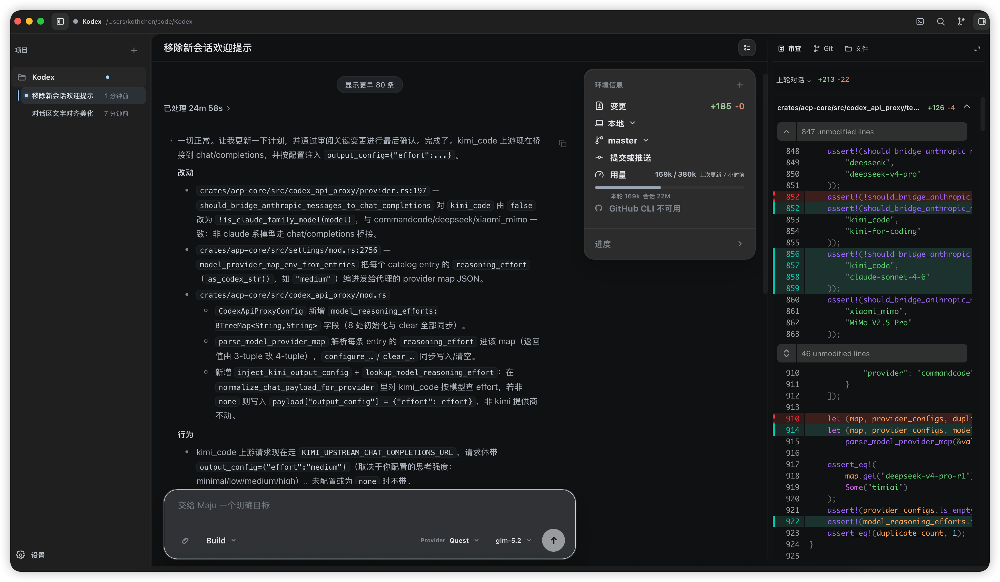
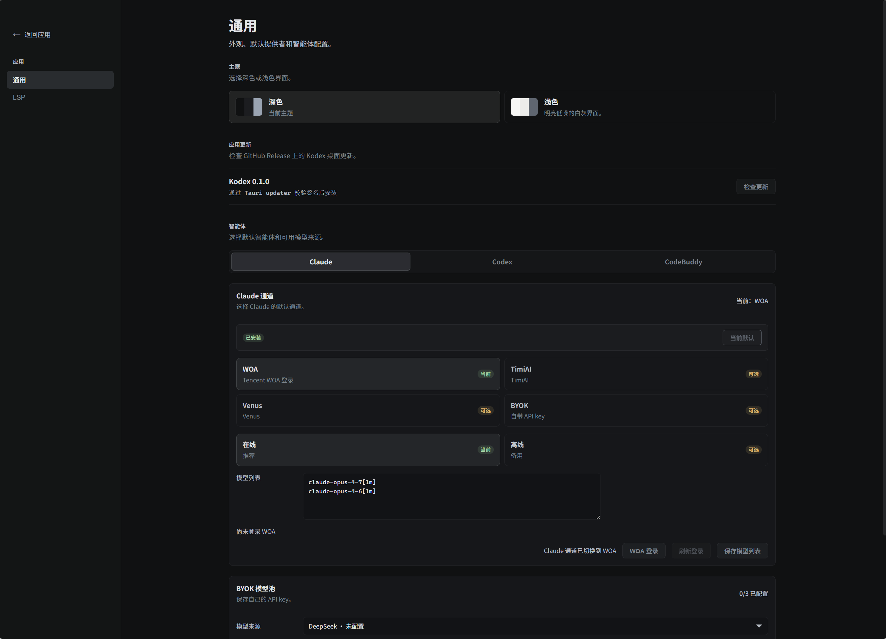

# Maju 桌面端上手指南

> 面向第一次使用 Maju 桌面版的用户。读完这篇，你能完成：装好 App → 配好模型（BYOK）→ 打开工作区 → 让智能体改代码、审 diff、跑终端。
>
> 界面文案引自代码原文（「」内逐字），与当前版本一致；截图取自较早版本，布局可能略有差异。

## 这是什么

Maju（码具）是一个**智能体编码工作台**：Rust/Tauri 承载本地能力，React + Monaco 提供编辑体验，把**智能体对话、代码编辑、Git 审阅、终端**放在同一个工作台里。智能体负责生成和执行方案，Maju 负责把上下文、文件、变更和权限边界托住。

| 工作台总览 |
|---|
|  |

核心概念一句话：Maju 本身**不含模型**，它通过 ACP 协议接入 Codex / Claude 智能体，并原生集成 DeepSeek Harness（dsh，经 host RPC 桥接，不走 ACP）；模型来自你自己的 API Key（BYOK 模式）。

## 一、安装与启动

**方式 A：使用已构建的安装包（普通用户）**
安装 `Maju.app` 到「应用程序」后直接启动，无需任何开发环境。

**方式 B：从源码构建（开发者）**
环境要求：Rust stable（Edition 2024）、Node.js v18+、Tauri CLI v2（`cargo install tauri-cli --version "^2"`）。

```bash
cd apps/desktop/ui
npm install
npm run desktop:build   # 前端 + codex-acp/claude-agent-acp 两个 ACP 适配器 + tauri 打包
# 开发模式（Vite + Tauri 热重载）：
cargo tauri dev
```

首次启动会进入欢迎页；数据全部落盘在 `~/.kodex/`（会话、配置、密钥、日志）。

## 二、首次启动：初始化引导

欢迎页顶部是 ASCII 艺术字「MAJU」和副标题「码具,码农的趁手好工具」，主操作区有两个按钮：**「打开本地文件夹」**和**「打开远程目录」**（SSH），下方是**「近期工作区」**列表（一键重开，每项右侧 × 可移除）。

首次启动的实际行为：

- **还没配模型来源**：欢迎页显示引导卡（kicker「开始前需要完成」，标题「初始化 Codex BYOK」，正文「还没有可用的模型来源。配置 Codex BYOK 后即可打开本地或远程工作区。」），此时「打开本地文件夹」是禁用的（悬停提示「请先在设置中配置模型来源」），并且会自动跳到设置页、弹出「初始化未完成」对话框。点**「设置 Codex BYOK」**或右上角齿轮（「打开设置」），按下一节配好任意一个 Key 即可解锁。
- **已配好**：启动时自动恢复上次的工作区（或最近列表里第一个存在的本地目录），基本不用再进欢迎页。

## 三、配置模型（重点）

### 3.1 先理解三个概念

- **智能体（Agent）**：干活的“大脑进程”。设置 → 通用页顶部有三个 tab：**「Claude」「Codex」「DeepSeek Harness」**，三者共享同一个模型池，任选其一作为默认即可（出厂默认 Codex）。
- **BYOK 模型池**：Bring Your Own Key——你把自己的 API Key 存进来，Maju 通过本机代理按模型路由到对应上游。**三个智能体共用这一个池子**，key 只需配一次。
- **模型来源（Provider）**：池子里的每一条渠道，内置了常用几家，也可以加自定义的。

> 旧版曾有「Default 通道」，现已移除：BYOK 是当前唯一的模型配置模式。

### 3.2 三分钟快速配置

1. 打开 **设置 → 通用 → 「BYOK 模型池」**（副文案「保存自己的 API key。」，右上角显示「N/M 已配置」）；
2. 在**「模型来源」**下拉选一个你持有 Key 的来源；
3. 在下方输入框粘贴 Key（如「输入 DeepSeek API key」），点**「保存」**。
   成功后提示「… API key 已更新,后续新建会话生效」——同一个 key 会同时对 Codex 和 Claude 两个智能体生效。

内置模型来源（按池内排序）：

| 来源 | Key 输入框标签 | 内置模型举例 | 说明 |
|---|---|---|---|
| TimiAI | 「TimiAI key」 | glm-5.2、gpt-5.5、claude-opus-4.8、gemini-3.5-flash 等 | 聚合网关 |
| CommandCode | 「CommandCode API key」 | claude-sonnet-4-6、claude-opus-4-8、gpt-5.5、Qwen3.7-Max、Kimi-K2.6、GLM-5.2、deepseek-v4-pro 等约 25 个 | 聚合网关，模型最全 |
| DeepSeek | 「DeepSeek API key」 | deepseek-v4-pro、deepseek-v4-flash | DeepSeek 官方 |
| Kimi Code | 「Kimi API key」 | kimi-for-coding | Kimi 编程专线 |
| Xiaomi Token Plan | 「Xiaomi Token Plan API key」 | MiMo-V2.5-Pro、MiMo-V2.5 | 小米 MiMo |

> 注意：设置页**不会回显**已保存的 Key（明文存于本机 `~/.kodex/config/provider-secrets.json`），已配置的来源输入框会变成「输入新的 … API key 以替换」，并有「清除设置」操作。

### 3.3 添加自定义 Provider

手上有其他 OpenAI/Anthropic 兼容渠道时：「BYOK 模型池」→「添加自定义」，填写：

- **名称**（如 `My Provider`）、**Endpoint**（如 `https://api.example.com/v1/chat/completions`）；
- **协议**：「Chat Completions」/「Responses」/「Anthropic Messages」三选一；
- **API key**；
- **模型列表**：逐行填模型 slug（如 `gpt-5.5`），「高级 ▼」里可设显示名、最大上下文、最大输出、多模态（「支持图像」）、Reasoning effort（Low/Medium/High/Max）；也可以填**「列表 URL」**点「同步」从远端拉取模型清单。

保存后该来源会出现在「模型来源」下拉里（自定义条目带「编辑」「移除」）。

### 3.4 选择默认智能体

设置 → 通用 → 某个 agent tab →「设为默认」（已默认的显示「当前默认」）。要点：

- 三个 tab 共用 BYOK 池，**选谁主要取决于你习惯哪个智能体的行为**；Codex 偏“全自动执行”，Claude 次之，DeepSeek Harness 是另一条技术栈（见 3.8）。
- 按钮要求对应 CLI 已安装，否则报「… is not installed」——用各 tab 里的「下载 / 安装」按钮一键装到 `~/.kodex/bin/`（优先用安装包内置版本，未内置时在线下载）。
- 如果设了环境变量 `ACP_AGENT_COMMAND`，设置页顶部会出现警告「`ACP_AGENT_COMMAND` 已设置,将覆盖此选择」且选择被禁用（开发调试用途）。
- 兜底：默认选了 Claude 但没配 key、而 Codex 已配好时，新建会话会自动落到 Codex。

### 3.5 会话级模型切换（composer）

设置页决定“池子里有什么”，**每个会话具体用哪个模型**在底部输入框右侧的两个下拉里选：

- **Provider 下拉**：切换本会话用的模型来源；
- **模型下拉**：切换该来源下的具体模型。

注意：**只能在会话空闲时切换**（运行中会报「会话控件只能在会话空闲时更改」）；选择只影响当前会话，重启后会恢复原样。

### 3.6 Claude 快速模型

「Claude」tab 里还有**「快速模型」**下拉（默认「自动」）：指定 Claude 内部处理轻量任务（如标题生成、摘要）用的小模型，可选池子里任意 BYOK 模型。

### 3.7 会话标题模型（建议配置）

设置侧栏**「会话标题」**页。背景（设置页原文摘要）：DeepSeek Harness 用一个独立小请求给每个会话起标题，默认继承会话自己的模型——**推理模型会把输出预算全花在推理上，导致标题请求返回空、会话退回“原始提问截断”当标题**。

建议在这里固定一个**非推理模型**（如 `kimi_code / k3`）：「模型来源」+「标题模型」成对选择，保存后显示「已固定」徽标，对**新建会话**生效（已有会话标题不会重算）。留空来源即恢复「跟随会话模型」。

### 3.8 DeepSeek Harness（dsh）

第三个 tab，不是 ACP agent，而是本机跑 `dsh web` 服务（需 `npm i -g @deepseek-ai/dsh`，tab 里有「检测更新」「升级到最新」）。特点：

- 使用同一个 BYOK 模型池；
- 有 **agent 预设（模式）**概念：tab 里「默认模式」下拉（首项「跟随 dsh 默认」），新建 dsh 会话时还可在创建弹窗里逐会话选预设；**预设在建会话时固定，之后只读**；
- 配合「会话标题」设置（3.7）使用体验最好。

### 3.9 配置落盘与手改须知（高级）

全部配置在 `~/.kodex/`（可用环境变量 `KODEX_DATA_ROOT` 整体重定向）：

| 文件 | 内容 | 手改注意 |
|---|---|---|
| `config/settings.json` | 默认智能体、选中的 provider、主题、各功能开关 | 可改，重启生效 |
| `config/provider-secrets.json` | 各 provider 的 API Key（**明文**） | 可改，注意别泄露 |
| `config/provider-models.json` | 模型目录（slug、上下文、多模态等） | 可改 |
| `config.toml` | Codex CLI 格式（Kodex 每次启动重写） | **改了会被覆盖**，要改去设置页 |
| `dsh/settings.yaml` / `dsh/kodex.patch.yml` | dsh 路由与覆盖层 | patch 文件头注明「Edit Kodex, not this file」 |
| `dsh/AGENTS.md` | 用户全局指令文件 | 首次生成后归你，随意改 |

| 首次设置（早期版本截图，布局可能略有差异） |
|---|
|  |

## 四、开始干活

### 4.1 界面速览

进入工作区后的布局（都可用顶部栏按钮开合）：

- **左侧项目栏**：「新建对话」大按钮（⌘K）、按工作区分组的会话列表、底部 footer（「登录」= 手机配对，「设置」）；
- **中央区**：会话时间线 + 文件/diff 标签页（超过 1 个标签时出现标签栏，未保存的关闭会弹「内容有改变」确认）；
- **右侧审查面板**：「审查」「Git」「文件」三个标签页（详见 4.4）；
- **底部终端 dock**：点会话头部的「打开终端」呼出（见 4.5）；
- **会话头部**：会话标题 + 三个按钮——「搜索工作区」（需本机有 ripgrep）、「打开终端」、「展开环境信息」。

窗口变窄时，右侧审查面板会自动折叠腾宽度，拉宽后自动恢复。

### 4.2 新建会话

点左侧栏**「新建对话」**（或项目行的「+」），弹窗「创建会话」里可以：

- 选**智能体**（默认项带「Settings 默认」徽标；未安装的标「 · 未安装」置灰）；
- 选 **Agent 预设**（仅 DeepSeek Harness 会话显示，默认「跟随 dsh 默认」）；
- 会话的 agent 和预设在创建时固定，之后不可改。

关于会话的几个事实：

- **标题自动生成**，没有手动重命名入口——dsh 会话由模型起名（可固定标题模型，见 3.7），其余 agent 回退为「原始提问截断」；
- 切换会话时若当前会话还在运行，会弹确认「切换同一工作区内的其他会话会中断当前任务」（「继续等待」/「停止并切换」）；
- 不需要的会话用行尾按钮**归档**（顶部弹「已归档"xxx"」toast，7 秒内可「撤销」），归档数据保留在本地，可在设置「已归档」页恢复或删除；
- 每个项目默认只显示最近 5 条会话，点「展开显示」逐次翻倍。

### 4.3 权限模式（composer 的 Mode 下拉）

输入框左侧的 **Mode 下拉**控制智能体的行动边界。**下拉里显示的模式名由智能体下发**（前端不硬编码，Codex 通道常见为 Plan / Build）：

- **Plan**：只读 + 仅允许编辑 Markdown，适合先看方案再动手；
- **Build**（codex 的 auto 档）：「Kodex can read and edit files in the current workspace, access the internet, and run commands. Approval is required to edit files outside the workspace.」——工作区内自由读写跑命令，**越出工作区必须你批准**。

权限请求会出现在输入框上方（眉标「待确认计划」/「需要权限」/「需要回答」），按钮本地化为「允许」「始终允许」「拒绝」「拒绝并补充说明」；Plan 模式下还有「接受计划」（确认后切换到执行）、「继续规划」「终止」。手机端配对后也能在手机上批（见 6.4）。

> DeepSeek Harness 会话的 Mode 控件是只读展示，它的“档位”在建会话时由 Agent 预设决定。

### 4.4 典型工作流

1. **下需求**：底部输入框（空闲时 placeholder「交给 Maju 一个明确目标」），Enter 发送、Shift+Enter 换行。
   - `@` 引用工作区文件/目录（或从文件树、编辑器选区右键「发送到上下文」）；`/` 调出智能体的斜杠命令；回形针可附加图片/文件。
   - 轮次运行中可继续发消息作为**「追加指令」**（steer）引导当前轮次；发送键在运行中变为**停止**（「停止当前轮次」）。
2. **看执行**：时间线里工具调用逐条展开（读文件、编辑、跑命令），长工具流自动折叠成「已处理 N 次工具调用」摘要条；「思考过程」可展开；断线时 composer 变为「会话已断开」+「重新连接」。
3. **审变更**：右侧审查面板——
   - 「审查」页：按**「上轮对话」**或**「手工修改」**两种范围看 diff（时间线里的「已编辑 N 个文件」ChangesBar 点「审核」直达）；
   - 「Git」页：整个 worktree 的变更，分「未暂存 / 已暂存 / 未跟踪」三组，逐文件「暂存」「取消暂存」「跟踪」，右键还能「撤销改动」（不可恢复，有确认框）、「发送到上下文」；
   - 文件点开是 diff 标签页，支持「内联/并排」切换。
4. **人工接管**：从文件树或变更列表打开文件，Monaco 直接编辑，⌘/Ctrl+S 保存；磁盘被外部改动时出现「磁盘内容已变化」横幅。markdown/html 默认预览，可切「编辑原文」。
5. **提交**：环境信息浮窗（会话区右侧，轮次进行中自动弹出）里有分支状态和「提交 / 提交并推送 / 推送 N 个提交」按钮；提交对话框支持多行约定式提交，还能点**「AI 生成」**用当前模型起草提交信息（用什么模型在设置「Commit 助手」页配）。

### 4.5 终端

会话头部「打开终端」呼出底部 dock：**按工作区复用**——重新打开会找回还在运行的终端并恢复滚动记录；「新建终端」才强制新开。每个终端 tab 显示 shell 和目录，点 × 即终止。

## 五、设置页其他分节速览

设置入口：欢迎页右上角齿轮，或会话列表底部「设置」。左侧导航共 10 个分节：

| 分节 | 干什么 |
|---|---|
| 「通用」 | 三大块：**主题**（深色/浅色卡片，默认深色）、**应用更新**（「检查更新」→「安装并重启」，走 Tauri updater 签名校验）、**智能体**（模型池与默认智能体，本文第三章） |
| 「远程」 | 管理 SSH 远程 Linux 开发机（名称/SSH 目标/端口；密码只在验证时临时输入、**不保存**），打开远程目录前先「验证」（SSH/目录/Agent/ACP 四项体检） |
| 「Web 工具」 | 给智能体注入 `web_search`/`web_fetch`：选搜索来源（Brave Search / Tavily）填 key，经本地 MCP server 下发 |
| 「图像能力」 | 识图（view_image，复用 BYOK key 配多模态模型）；生图/改图独立配协议（OpenAI images / chat 内联 / Gemini）与模型，产物存 `~/.kodex/generated-images` |
| 「Commit 助手」 | 「AI 生成」提交信息用的模型（基于 codex agent 独立跑，不配则跟随当前会话模型） |
| 「会话标题」 | 固定非推理标题模型（见 3.7） |
| 「已归档」 | 已归档会话的搜索/恢复/删除（「全部删除」有确认） |
| 「陪伴角色」 | 3D 桌宠开关与外观（全本地运行，可选 .vrm 模型，语气强度三档） |
| 「用量」 | token 用量仪表盘：按 模型/智能体/工作区/会话 分组，今天/7 天/30 天/全部 筛选；含总 tokens、请求数、「每日趋势」堆叠图与分组明细表（输入/输出/缓存读/缓存写/推理、延迟、TTFT、速度）。Codex / Claude / DeepSeek Harness 上报详细用量 |
| 「LSP」 | 编辑器的 language server 管理（启用开关、命令/参数、探测/保存/重置） |

## 六、进阶

### 6.1 分叉与交接

助手消息的操作菜单里有两个进阶动作：

- **「分叉对话」**：从任意一轮创建分支（「在此工作空间中创建分支」/「在新工作树中创建分支」），适合“这条路走不通，回到第 N 轮换个说法重试”；
- **「交接给下一个智能体」**：把当前会话的目标、进展、改动文件整理成交接说明（可点「用模型润色」，用的是「会话标题」里配的模型），选另一个 Agent「新建会话并带入」——适合 Codex 卡住了换 Claude 接着干。

### 6.2 共享 MCP

Maju 进程内自带两个本地 MCP server（`kodex-web-tools`、`kodex-image`），随进程惰性启动，自动注入到每个会话——你不需要手配任何 MCP 文件。

### 6.3 远程（SSH）工作区

欢迎页「打开远程目录」或项目栏「+」→「打开远程目录」：选已保存的机器（没有就去设置「远程」页添加）→ 输 SSH 密码（**本次使用,不保存**；用 key/ssh-agent 可留空）→ 填远程绝对路径、选通道 Agent →「验证目录」→「打开目录」。打开过程有阶段进度条（「连接」「环境」「目录」「验证」「启动」）；休眠的远程项目**双击项目行可重连**。远端 agent 装到该机的 `~/.kodex/remote-agents/`，远程运行时设置可按机器单独覆盖。

### 6.4 手机遥控

会话列表底部「登录」→ 邮箱验证码登录 →「配对二维码」，手机装 Maju App 扫码即可远程看会话、发指令、批权限、收完成提醒。详见 [`docs/mobile-user-guide.md`](mobile-user-guide.md)。

## 七、常见问题

**Q：新建会话按钮灰着 / 提示「还没有可用的模型来源」？**
还没配 BYOK。设置 → 通用 → BYOK 模型池，保存任意一个 API key 即可（见 3.2）。

**Q：提示「{binary} is not installed」或「dsh CLI not found on PATH」？**
对应智能体没装：Codex/Claude 用各自 tab 的「下载/安装」；dsh 需 `npm i -g @deepseek-ai/dsh`。

**Q：composer 里模型下拉改不动？**
会话运行中不能改，等它空闲（「会话控件只能在会话空闲时更改」）。

**Q：会话标题总是“原始提问截断”？**
用的是推理模型，标题请求被推理预算吃光了。按 3.7 固定一个非推理标题模型。

**Q：提示「模型上下文超限」或「与模型服务的流式连接已过期」？**
前者：历史太多超窗口，新建会话或压缩上下文；后者：空闲过久连接被服务端断开，重试或新建会话。

**Q：Key 存哪安全吗？**
明文存于本机 `~/.kodex/config/provider-secrets.json`（仅本机可读权限），UI 只写不回显；换机需重新填。

**Q：想完全重置？**
退出 App 后备份并删除 `~/.kodex/`（会话记录也会一起删掉，谨慎）。

---

*本文档对应当前仓库版本；界面文案引自代码原文，如与后续版本不一致，以 App 实际显示为准。手机端指南见 [`docs/mobile-user-guide.md`](mobile-user-guide.md)，架构见 [`docs/architecture.md`](architecture.md)。*
