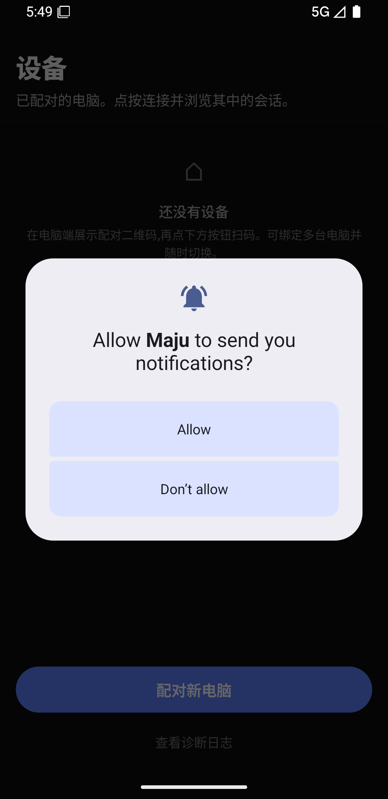
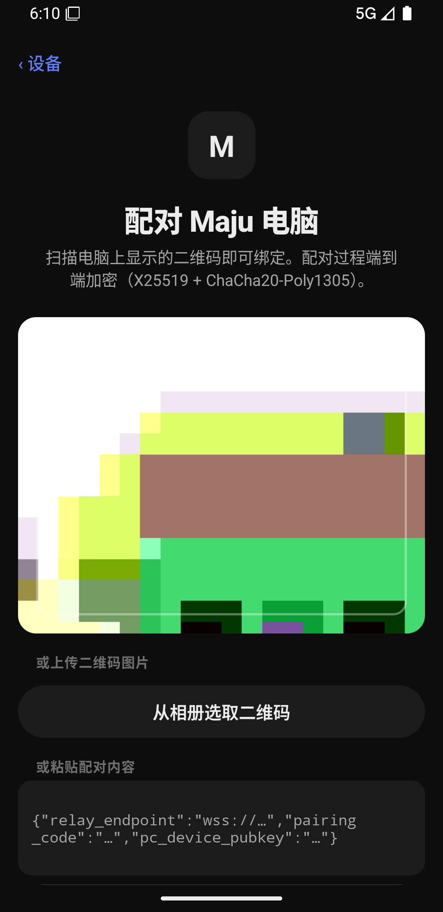
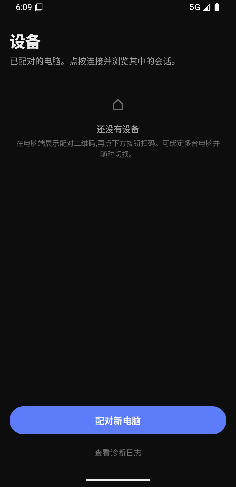
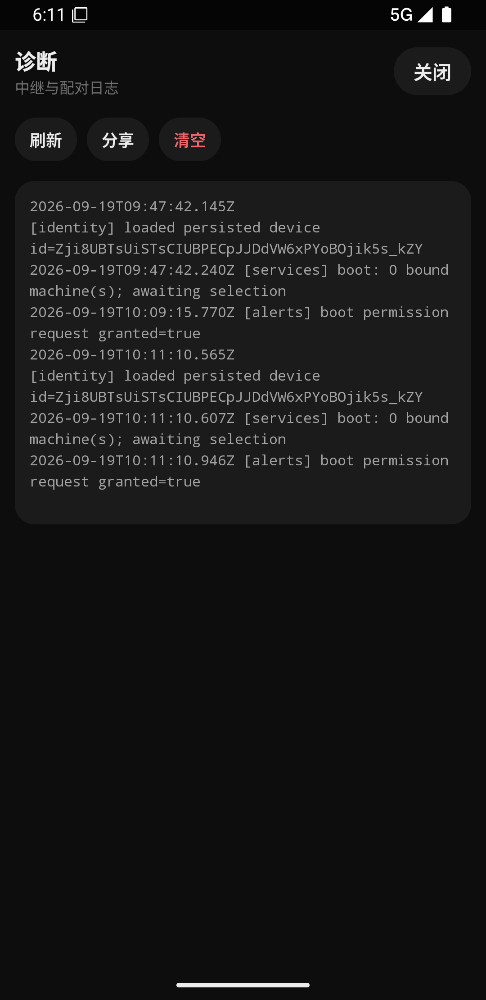

# Maju 手机端上手指南

> 面向第一次使用 Maju 手机 App 的用户。读完这篇，你能完成：装 App → 配对电脑 → 在手机上发指令、看进度、批权限、收完成提醒。
>
> 适用版本：Maju 手机端 0.1.4（包名 `com.kodex.mobile`，深色界面，UI 为中文；少量状态词为英文原文，文中会注明）。截图以 Android 为例。

## 这是什么

Maju 手机端是 **Maju 桌面版（PC）的随身遥控器**：在电脑上跑着的编码智能体，你可以用手机远程查看会话、发送指令、审批权限请求，并在任务完成时收到提醒。

工作原理一句话：**手机与电脑都连接同一台中继服务器（relay），全部流量端到端加密（X25519 + ChaCha20-Poly1305），中继只转发密文**。因此：

- **不要求手机和电脑在同一 Wi-Fi**——只要能上网即可；
- 中继服务器看不到你的任何会话内容；
- 唯一连通条件是电脑端显示「已连接 relay」。

## 一、准备工作

| 端 | 需要做什么 |
|---|---|
| 电脑 | 安装并**打开** Maju 桌面版（保持运行即可，无需打开特定工作区） |
| 手机 | 安装 Maju App（从开发者处获取 APK 安装包，覆盖安装即可升级） |
| 网络 | 两端都能访问中继服务器（默认使用官方中继，**无需任何配置**） |

> 首次启动后建议把 Maju 的省电策略设为「无限制」并允许后台运行——部分国产 ROM 会很快冻结后台应用，影响后台提醒的可靠性（详见「轮次完成提醒」一节）。

## 二、首次启动：通知权限

第一次打开 App，系统会弹出通知权限请求：

- **建议点「Allow」**：这决定了 App 退到后台时能否用系统通知提醒你「任务已完成 / 已中断」。
- 点「Don't allow」也能正常用 App，只是后台收不到系统通知（前台的横幅、提示音、震动不受影响）。以后想开：系统「设置 → 应用 → Maju → 通知」手动开启，或在 App「设置」页点黄色提示重新申请。

App 不会索取定位、麦克风等其他权限。相机和相册权限只在**扫码配对**时按需请求。

## 三、配对电脑（核心步骤）

配对 = 用手机扫电脑上的二维码，一次性绑定。可以绑定多台电脑。

### 第 1 步：电脑端打开配对二维码

1. 在 Maju 桌面版主界面，点**左侧栏底部的账号按钮**（未登录显示「登录」）。
2. 未登录会先走邮箱验证码登录：输入邮箱 →「发送验证码」→ 输入 6 位验证码 →「登录」。（登录是为了 PC 重启后免扫码重连；验证码 10 分钟内有效。）
3. 登录后弹窗里出现**「配对二维码」**面板。确认左下角状态是 **「● 已连接 relay」**：
   - 显示「○ 未连接 relay」时二维码灰显，扫码一定失败——检查电脑网络后点「手动刷新」。
   - 显示「正在把配对码注册到 relay…」时稍等片刻再扫。
4. 二维码**有效期 120 秒**，到期自动刷新（界面显示剩余秒数），不用手动管。

### 第 2 步：手机端扫码

打开 App 即进入**设备页**，点底部「配对新电脑」：

三种方式任选其一：

- **扫码**：首次使用点「授权相机」授予相机权限，对准电脑上的二维码即可；
- **相册识别**：点「从相册选取二维码」，选一张二维码截图（比如把 PC 屏幕拍照/截图发到手机）；
- **手动粘贴**：把二维码里的 JSON 内容粘贴进「或粘贴配对内容」输入框，点「开始配对」（适合远程场景）。

成功后自动进入会话列表，设备页会多出这台电脑（名字取自电脑主机名）。**每扫一台就追加一台，不会覆盖已有绑定。**

### 配对失败对照表

失败时配对页红字提示原因，按下表处理：

| 红字提示（原文） | 原因与处理 |
|---|---|
| 「二维码已失效：电脑端的二维码过期或未注册到 relay，请在电脑上刷新二维码后重扫」 | 二维码超过 120 秒没扫，或注册未完成。等电脑端二维码刷新后再扫 |
| 「目标电脑当前没有连上 relay：请在电脑端确认显示「已连接 relay」后再扫码」 | 电脑离线/没连上中继。先让电脑恢复网络，确认「● 已连接 relay」 |
| 「配对超时：二维码可能已过期，请刷新 PC 端二维码后重试」 | 30 秒握手超时，多为网络不稳或二维码过期，重扫即可 |
| 「配对记录已失效：请重新扫描电脑端的二维码」 | 这台手机上的旧配对记录失效，重新扫码 |
| `refusing non-TLS relay endpoint: …` | 二维码里的中继地址不是加密的 `wss://`（自建中继才会遇到，见文末「自建中继」） |
| `ws open failed` / `relay closed during pairing handshake` | 手机连不上中继服务器，检查手机网络（代理/VPN 可能拦截） |

> 桌面端**没有**「已配对设备列表」——绑定关系由手机持有，解绑也在手机上操作（见「多台电脑」一节）。

## 四、界面速览

### 设备页（打开 App 的第一屏）

- 列出所有已配对的电脑：名字、地址、「配对于 M 月 D 日」；当前连接的电脑行尾有**绿点 + 「已连接」**。
- 点任意一台即连接并进入它的会话列表；连接中显示「连接中…」。
- 长按某台电脑（或点行尾「解绑」）可解除绑定。
- 底部「查看诊断日志」可直达诊断页（排障用，见「常见问题」）。

### 会话列表（连上电脑后）

- 顶栏标题「Maju」，左上角是**电脑切换芯片**（圆点 + 电脑名，点按可换电脑），右上角「设置」。
- 两个 Tab：**「项目」**（按工作区分组，默认）和**「聊天」**。
  - 项目行右侧「+」= 在该工作区新建会话；「›」展开/收起其中的会话。
  - 会话状态一目了然：绿字「运行中」/ 红字「已中断」/ 灰字「空闲」，外加相对时间（「刚刚」「N 分钟前」「昨天」…）。
- 右上角「新建」：「项目」Tab 下建全局会话，「聊天」Tab 下建聊天会话。
- 下拉可刷新；「还没有项目」时表示电脑端还没打开任何工作区——**在桌面端打开一个工作区后它会自动出现在这里**。

### 会话页（点进一个会话）

- 顶部是会话名和状态小字；右上角 ⋮ 打开**「会话信息」**：模型、预设、Provider、智能体、上下文占用（进度条 + 百分比）、本轮与会话累计 token 用量。
- 中间是时间线：你的消息在右侧气泡，智能体回复是全宽正文；数学公式、图片都能正常显示。
- 底部输入框（占位文字「给智能体发消息…」），右侧圆形 **↑** 发送。**智能体运行中也能继续发消息**（会作为 steer 插入），此时输入框旁还会出现一个圆形**停止键**，点按取消本轮。

## 五、日常使用

### 看智能体干活

- 思考中显示「思考中…」；工具调用是扁平的一行：`● 动词 命令/文件名 (+N -N) ›`。
- 动词是英文原文：**Running / Searching / Editing / Asking**（进行中）→ **Searched / Ran / Edited / Asked**（完成）、**Failed**（失败）、**Interrupted**（中断）。
- 点工具行可展开：输出行、diff 预览（绿 + 红 −，未更改段折叠成「⋯ N 行未更改 ⋯」点按展开）、原始 Request/Result。
- 连续多个普通工具会自动折叠成一行摘要（如 `Searched ×2 · Ran ×1 · Edited 3 files`），点按展开。
- 输入框上方的**「本轮改动 N 个文件 +N −N」**细条，点开能看到本轮改了哪些文件，再点文件进全屏 diff。运行中的工具若支持，行尾有红色「停止」按钮可单独终止。

### 审批权限请求（重点）

智能体要做敏感操作时，手机底部会弹出**「请求授权」**浮层（涉及修改的操作右上角有红字「写操作」）。两种形态：

1. **问答表单型**：按题作答——单选（圆点）/ 多选（方点，可点多个）/ 文本框自由输入，然后提交；
2. **纯选项型**：直接点「允许」「拒绝」「提交」「取消」等按钮。**注意：没有任何预选，必须显式点选**，不点就提交会被视为拒绝。

**破坏性操作**（编辑/删除文件、执行命令等）有二次确认：点允许后出现黄字警示「此操作可能修改你的工作区,确认后放行。」，再点红色**「确认放行」**才真正执行；点「拒绝」中止。只读操作一步即可放行。

其他要点：

- 按手机**返回键 = 拒绝**；
- 浮层 120 秒无人处理会自动消失，电脑端视为未授权并中止该操作；
- 默认拒绝（default-deny）：任何远程操作都不会被自动批准。

### 取消与中断

- 取消整轮：点输入框旁的圆形停止键；
- 停单个工具：工具行尾「停止」（仅运行中且该工具支持时出现）；
- 你主动取消的轮次不会触发中断提醒（5 秒抑制窗口）。

## 六、轮次完成提醒

一轮任务结束（完成或被中断）时，App 按你当时所在位置选择提醒方式：

| 你当时在 | 提醒方式 |
|---|---|
| 正在看这个会话 | 仅轻震动，不打扰 |
| App 前台的其他页面 | 提示音 + 震动 + 顶部横幅（「本轮已完成，点击查看结果」，点横幅直达该会话，5 秒自动消失） |
| App 在后台 | 系统通知：「任务已完成 ✅」或「任务已中断 ⚠️」 |

### 提醒开关（会话列表 → 右上角「设置」）

| 开关 | 默认 | 作用 |
|---|---|---|
| 「轮次结束时提醒」 | 开 | 总开关，关掉后下面全部失效 |
| 「提示音」 | 开 | 前台提示音 / 后台通知声音 |
| 「震动」 | 开 | 前台触觉 / 后台通知震动 |
| 「仅后台时提醒」 | 关 | 打开后前台完全静默，只有后台系统通知 |
| 「系统通知（应用在后台时）」 | 开 | 后台系统通知总开关；首次开启会申请通知权限 |

通知权限被拒时，设置页会显示黄色提示，点按可重新申请。

> **重要限制**（设置页脚注原文）：「提醒依赖 App 进程与电脑的连接存活；应用被系统结束后无法收到提醒（后续版本将支持服务端推送）。部分国产 ROM 会很快冻结后台应用，请将 Maju 的省电策略设为"无限制"并允许后台运行，后台通知才可靠。」

## 七、多台电脑

- **加绑**：设备页「配对新电脑」，重复扫码流程即可，数量不限；
- **切换**：会话列表左上角芯片 →「切换电脑」浮层，绿点表示当前已连接的那台，点按即换（会话列表会自动刷新为新电脑的）；
- **断开**：设置页底部红色「断开连接」，断开后回到设备页；
- **解绑单台**：设备页长按该电脑（或点行尾「解绑」）→ 确认弹窗；
- **全部解绑**：设置页「解绑所有设备」→「全部解绑」，清空后需重新扫码配对。

换手机或重装 App 后，原绑定**不会**迁移，需要重新扫码（设备密钥存在系统安全区，卸载即销毁，见下节）。

## 八、常见问题排查

**Q：点电脑后一直「连接中…」或报「恢复连接失败：…」？**
电脑没连上中继（关机/断网/桌面版没开）。到电脑端确认 Maju 在运行且配对面板显示「● 已连接 relay」，再回手机重试。

**Q：会话操作报 `not connected: pair with a PC first`，切换芯片显示「未选择电脑」？**
连接彻底断开且自动重连失败（连续失败 8 次后该失效绑定会被自动移除）。点芯片换一台电脑，或重新扫码配对。

**Q：后台收不到完成通知？**
按顺序查：① 系统「设置 → 应用 → Maju → 通知」是否允许；② App 设置里「轮次结束时提醒」和「系统通知」两个开关是否开着；③ 是否被 ROM 杀了后台（把 Maju 省电策略设为「无限制」）；④ App 被杀后本来就收不到提醒（当前无服务端推送，属已知限制）。

**Q：提示「该改动已不在桌面端的实时窗口内」？**
全屏 diff 依赖电脑端内存中的实时数据，桌面版重启后只保留最近 30 轮，更早的改动请在电脑上查看。

**Q：我想看连接细节/给开发者报问题？**
设备页或配对页点「查看诊断日志」（已连接时在 设置 → 诊断日志）：

里面是带时间戳的中继与配对日志，可「刷新」「清空」，点**「分享」**能把完整日志发给开发者。

## 九、安全与隐私

- **端到端加密**：配对时双方用 X25519 交换密钥、HKDF 派生会话密钥，之后全部控制指令与会话数据用 ChaCha20-Poly1305 加密传输；**中继服务器只路由密文**，无法读取内容。
- **密钥不出安全区**：手机设备密钥存在系统安全存储（Android Keystore / iOS Keychain），**卸载 App 即销毁**；E2E 会话密钥只在内存中，断开即弃。
- **配对码一次性**：二维码里的配对码 120 秒有效、用一次即废，截图泄露风险窗口很小。
- **权限默认拒绝**：敏感操作必须你在手机上显式批准，破坏性操作还要二次确认，不存在"自动放行"。

## 附：自建中继（高级，普通用户可跳过）

默认使用官方中继，开箱即用。如需自建：

- 服务端源码在仓库 `server/`，部署脚本 `scripts/deploy-relay.sh` + `scripts/relay/`（WS :8787、health :8788、auth :8789，SQLite 存储，Nginx 终止 TLS）；
- 桌面端用环境变量切换：`KODEX_RELAY_ENDPOINT`（中继地址）、`KODEX_RELAY_AUTH_ENDPOINT`（登录 HTTP 地址，默认可由中继地址推导）、`KODEX_RELAY_INSECURE_TLS=1`（允许自签证书）、`KODEX_REMOTE_CONTROL=0`（彻底关闭远程控制）；
- 手机端二维码只接受 `wss://` 地址；开发形态的明文 `ws://` 仅限裸 IP / localhost / `.local` 地址。有正式域名请配置真实证书。

---

*本文档对应 Maju 手机端 0.1.4；界面文案引自代码原文，如与后续版本不一致，以 App 实际显示为准。开发者文档见 `apps/mobile/README.md`，验收清单见 `apps/mobile/VERIFICATION.md`。*
